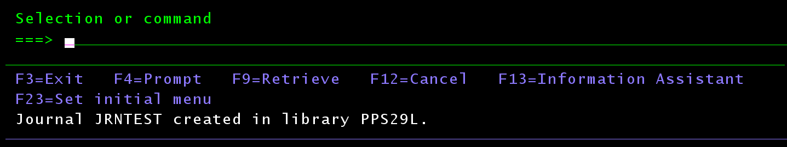

# Platformy programowo-sprzętowe IBM
## Sprawozdanie z laboratorium

Data | Tytuł zajęć | Uczestnicy
:-: | :-: | :-:
04.05.2021 13:15 | Journaling | Bartosz Rodziewicz (226105)

### Część teoretyczna
#### Jak działa journaling?
Journaling działa w formie zapisywania poszczególnych wydarzeń w formie logów dotyczących chronionych plików do dziennika. Pozwala on na śledzenie zmian oraz innych operacji na chronionych plikach.

#### Jakie obiekty są niezbędne, reguły?
* obiekt typu journal - przechowujący reguły ochrony plików
* obiekt typu journal receiver - obiekt powiązany z obiektem typu journal, w którym obiekt journal zapisuje logi dotyczące plików oraz ich obrazy
* obiekty chronione, których modyfikacja i inne operacje na nich podlegają logowaniu w dzienniku

Reguły logowania przechowywane w obiekcie typu journal, są one również niezbędne do poprawnego działania dziennika.

#### Co możemy odnotowywać?
Odnotować w dzienniku można wiele operacji i najlepszym w tym miejscu będzie podlinkowanie dokumentacji, która dokładnie opisuje każdy możliwy kod wpisu w dzienniku: https://www.ibm.com/docs/en/i/7.1?topic=information-all-journal-entries-by-code-type.

#### Które ze zmian są odwracalne automatycznie (komendą), a które tylko "do wiadomości"?

Tutaj tak samo jak w powyższym punkcie najlepszym będzie podlinkowanie dokumentacji, która opisuje czy dany wpis można odwrócić (lub nałożyć) komendą, czy jest on tylko dla wiadomości: https://www.ibm.com/docs/en/i/7.2?topic=rjo-actions-applying-removing-journaled-changes-by-journal-code.

### Część praktyczna
#### Utworzyć obiekt typu journal i journal receiver
Instrukcja laboratoryjna mówi by najpierw utworzyć obiekt journal, a dopiero później journal receiver, jednak tworzenie obiektu journal wymaga podania journal receivera, więc zamieniłem kolejność.

Do utworzenia obiektu journal receiver użyta została komenda `CRTJRNRCV jrcvtest`.

  
_Utworzenie obiektu journal receiver._

Do utworzenia obiektu journal receiver użyta została komenda `CRTJRN`.

  
_Prompt dla komendy CRTJRN._

  
_Utworzenie obiektu journal._

#### Skonfigurować ochronę wybranego obiektu
Do ochrony stworzony został source physical file komendą `CRTSRCPF fileforjrn`.

  
_Utworzenie obiektu do ochrony._

Następnie został utworzony w nim member oraz dodane zostało kilka linijek jakiegoś tekstu.

  
_Tworzenie membera w pliku tekstowym._

  
_Utworzenie membera w pliku tekstowym._

Następnie skonfigurowana została ochrona pliku komendą STRJRNPF.

  
_Start ochrony pliku w dzienniku._

Tutaj trzeba zaznaczyć, że wystartowana została ochrona z parametrem "Recording images" ustawionym domyślnie, czyli na `*AFTER`. Będzie to skutkować pewnym problemem w dalszej części realizacji laboratorium.

#### Wprowadzić w chronionym obiekcie kilkukrotne zmiany
W pliku kilkukrotnie wykonana została modyfikacja jednego membera oraz dodany został drugi member i poddany on został również modyfikacji.

  
_Modyfikacja membera._

#### Pokazać, że zmiany zostały zapisane w kronice
Otwarcie dziennika możliwe jest komendą `DSPJRN`. Po otwarciu widać, że zmiany zostały zapisane. Tutaj trzeba zwrócić uwagę, że wpisy w dzienniku mają różne kody i każdy z tych kodów coś znaczy. Dla nas najbardziej interesujące są kody `R PT` czyli dodanie nowej linijki do membera. Inne kody w dużej mierze to kody informacyjne (jak np otwarcie lub zamknięcie membera). Pełna lista znaczenia kodów znajduje się pod tym linkiem: https://www.ibm.com/docs/en/i/7.1?topic=information-all-journal-entries-by-code-type. Aby ułatwić przeglądanie dziennika, komenda `DSPJRN` posiada mechanizm filtorwania umożliwiający np. wyświetlenie jedynie operacji z kodem `R` (parametr "Journal code value" - `JRNCDE`).

  
_Zawartość dziennika po kilku modyfikacjach, trzeba zwrócić uwagę, że znajduje się w nim kilka stron wpisów (dokładnie 63 pozycje)._

  
_Wpis potwierdzający edycję/dodanie linijki do membera._

#### Odwrócić wybrane zmiany
Mechanizm journalingu w systemie AS400 posiada dwie metody wykorzystania zapisów z dziennika.

Można odwrócić zmiany (komenda `RMVJRNCHG`) podając które zmiany chcemy odwrócić i odwracane są one od końca do podanej zmiany.

Można również "nałożyć" (komenda `APYJRNCHG`) zalogowane zmiany, od samego początku pracy dziennika do podanej zmiany. W wielu miejscach w dokumentacji jest informacja, że jeżeli z jakiegoś powodu nie jest możliwe przywrócenie zmian, należy skorzystać z nakładania.

W tym kroku pojawiają się wspomniane wcześniej problemy. Z uwagi na ustawienie journalingu w trybie zapisywania obrazów pliku tylko po edycji niemożliwe staje się bezpośrednie odwracanie zmian (komenda `RMVJRNCHG`), co pokazane zostało na poniższych zrzutach.

  
_Wywołanie komendy `RMVJRNCHG` wymaga podania nazwy journala oraz pliku do owrócenia zmian._

  
_Na drugiej planszy prompta dla komendy `RMVJRNCHG` konieczne jest podanie jakie zmiany chcemy odwrócić._

  
_Błąd mówiący o braku możliwości skorzystania z odwracania zmian z powodu braku journalingu z parametrem "Record images" ustawionego na `*BOTH`_.

Do zaprezentowania działania journalingu wykorzystana została więc komenda `APYJRNCHG`.

Poza ustawieniem nazwy dziennika oraz pliku komenda ta wymaga podania również parametrów od i do (`FROMENTLRG`, `TOENTLRG`), gdzie pierwszy powinien być ustawiony na `*FIRST`, a drugi na zmianę do której chcemy przywrócić. Dodatkowo konieczna jest zmiana wartości parametru `RCVRNG` (Starting journal receiver) na wartość `*CURRENT`. Nie byłem w stanie znaleźć w dokumentacji, dlaczego domyślny parametr nie działa w tym wypadku.

  
_Wypełnienie parametrów dla komendy APYJRNCHG._

  
_Błąd przy nakładaniu zmian._

Tutaj pojawił się problem z nałożeniem wybranych zmian na plik. Znalazłem w dokumentacji, że nie można wybrać sobie zakresu zmian, które chce się nałożyć i liczyć, że nałożone zostaną tylko te które można nałożyć, a dokładniej, że koniec zakresu musi być poprawną, możliwą do nałożenia zmianą. To w jaki sposób konkretne wpisy są traktowane przez różne komendy do przywracania zmian z dziennika można znaleźć pod tym linkiem: https://www.ibm.com/docs/en/i/7.2?topic=rjo-actions-applying-removing-journaled-changes-by-journal-code.

Zmiana końcowej zmiany na zmianę typu `R PT` spowodowała, że komenda się wywołała poprawnie i zawartość pliku została przywrócona do tej z tamtej rewizji.

  
_Poprawne nałożenie zmian._

  
_Treść pliku po nałożeniu zmian._

Tutaj trzeba też zaznaczyć, że takie nałożenie zmian, zamiast przywrócenia mimo, że poprawnie "przywróciło" zawartość jednego membera na tamtą rewizję, nie usunęło np. drugiego membera stworzonego później. Jednbak gdyby najpierw wyzerować plik to oczywiście ten drugi member się by nie pojawił, dopóki nie doszlibyśmy z nakładaniem zmian, aż do zmiany dodającej tego drugiego membera.

Wykorzystanie poprawnej metody przywracania zmian (`RMVJRNCHG`) rozwiązało by problem i usunęło tego drugiego membera w trakcie przywracania zmian z dziennika.
