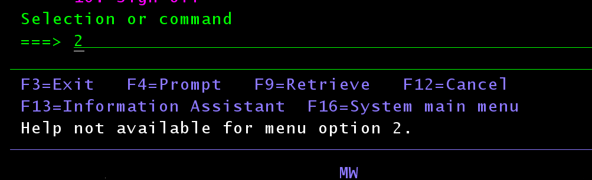

# Platformy programowo-sprzętowe IBM
## Sprawozdanie z laboratorium

Data | Tytuł zajęć | Uczestnicy
:-: | :-: | :-:
18.05.2021 13:15 | Menu | Bartosz Rodziewicz (226105)

### Przebieg zajęć
Poniżej opiszę proces stworzenia prostego menu w systemie IBMi.

Do stworzenia menu potrzeba pliku w którym zapisany zostanie member przechowujący edytowalną wersje menu. Z tego też powodu utworzyłem plik `MENUFILE` komendą `CRTSRCPF`.

  
_Utworzenie fizycznego pliku MENUFILE._

Do tworzenia menu najlepiej użyć polecenia `STRSDA` - Start Screen Design Aid.

  
_Uruchomiony Screen Design Aid._

Do tworzenia menu służy opcja 2, jednak warto najpierw utworzyć jakiś ekran i poznać dostępne opcje pod opcją 1. Ja skupię się jednak na samej opcji tworzenia menu.

Po wybraniu opcji 2 trzeba wskazać plik oraz wybrać nazwę membera w którym przechowywane będzie menu w wersji edytowalnej.

  
_Ekran wyboru pliku, gdzie przechowywane będzie menu._

Na kolejnym ekranie należy wybrać czy chcemy edytować menu (wygląd ekranu menu oraz komendy, które są przypisane do opcji menu), czy edytować pozycje pomocy dostępnej pod F1.

Najpierw opiszę edycję samego menu. Wygląda ona podobnie jak tworzenie ekranu, jednak po włączeniu pustego menu stworzone są już pewne pola.

  
_Ekran tworzenia menu._

  
_Ekran tworzenia menu ze stworzonym przykładowym menu._

Po wypełnieniu pól pozycjami menu, można wykonać lekką modyfikację menu, poprzez np zmianę kolorów pól tekstowych lub dodaniem czasu.

Każde pole posiada znak kontrolny w który po wpisaniu specjalnego kodu możliwa jest manipulacja nim. Najważniejsze kody to:
* `d` - usunięcie pola
* `cX` - zmiana koloru, gdzie w miejsce X należy podać literkę koloru (np. `r` - red, `g` - green, `b` - blue, `y` - yellow, `w` - white, itd.)
* `ac` - wyśrodkowanie pola do środka ekranu

Domyślnie każda spacja powoduje, że słowa stają się osobnymi polami. Połączenie kilku słów w jedno pole możliwe jest poprzez wpisanie ciągu znaków w cudzysłowach `'`. Gdy łączone są pola już obecne pierwszy cudzysłów musi znajdować się na polu kontrolnym pierwszego łączonego pola.

Aby ułatwić sobie edycję i zrozumienie jak wyglądają pola w menu warto użyć klawisza F20, aby wyświetlić podział tekstu na pola.

  
_Ekran tworzenia menu z zaznaczonymi polami tekstowymi._

Menu można wzbogacić zegarkiem, datą lub polem z nazwą użytkownika używając odpowiednio specjalnych zmiennych - `*TIME`, `*DATE` i `*USER`.

Kolejnym etapem tworzenia menu jest podanie komend pod kolejne cyfry. Do tego należy włączyć ekran edycji komend znajdujący się pod klawiszem F10.

Pod każdą cyfrę z menu należy wpisać komendę, która ma zostać uruchomiona. Aby jednak móc wybrać komendy z parametrami, należy wpisać komendę, oraz wypisać parametry ze specjalnym przedrostkiem i opcjonalnie wartością. Dokładnie opisane jest to w dokumentacji w tym miejscu: https://www.ibm.com/docs/en/i/7.1?topic=time-using-selective-prompting-cl-commands. Tylko wyszczególnione parametry z odpowiednim przedrostkiem będą możliwe do uzupełnienia dla użytkownika menu.

  
_Ekran edycji komend menu._

  
_Ekran edycji komend menu - drugi ekran._

Zapisanie komend wykonuje się klawiszem `ENTER`, następuje wtedy powrót do edycji ekranu menu. Aby zapisać ekran menu, należy opuścić ekran edycji. Wraca się wtedy do wyboru edycji ekranu oraz pomocy. Przed zapisaniem opiszę po krótce tworzenie pomocy do menu. Aby włączyć edycję pomocy należy w odpowiednim miejscu wpisać `Y`.

Ekrany pomocy dodaje się do odpowiednich pozycji menu. Możliwe jest stworzenie ogólnego ekranu pomocy dla danego menu (ekran dla pozycji 0), możliwe jest stworzenie ekranu dla konkretnej pozycji, oraz jednego ekranu dla kilku pozycji (ekran dla zakresu pozycji).

  
_Ekran edycji ekranów pomocy menu._

Na cele zadania stworzyłem jedynie ekran ogólny i ekran dla pozycji 1. Tworzenie ekranu pomocy nie różni się zbyt wiele od tworzenia ekranu menu, edytor działa bardzo podobnie.

Po stworzeniu odpowiednich ekranów pomocy, zapisanie całego menu następuje poprzez wyjście z edytora pomocy oraz z ekranu wyboru trybu edytora. Pojawia się wtedy pytanie czy zapisać ekran menu oraz czy go skompilować. Domyślnie obie opcję są zaznaczone. Po skompilowaniu menu możliwe jest bezpieczne opuszczenie SDA.

Uruchomienie (przejście do) stworzonego menu możliwe jest komendą `GO <nazwa_menu>`.

  
_Menu utworzone na potrzeby tego zadania._

Aby wyświetlić utworzoną pomoc należy wpisać oczekiwaną pozycję w menu (np. 1) oraz kliknąć klawisz `F1`.

  
_Ekran pomocy dla pozycji 1._

Wciśnięcie `F1` bez wpisania żadnej pozycji skutkuje uruchomieniem ogólnego ekranu pomocy dla tego menu.

  
_Ogólny ekran pomocy menu._

Wciśnięcie `F1` dla pozycji, która nie posiada pomocy skutkuje poniższym komunikatem o błędzie.

  
_Komunikat o braku ekranu pomocy dla danej pozycji._
